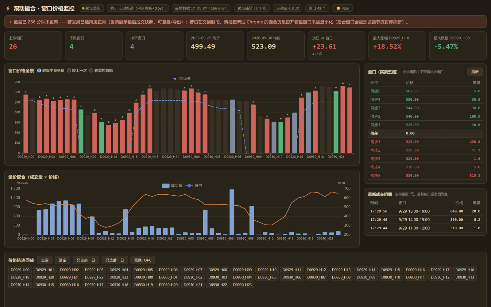
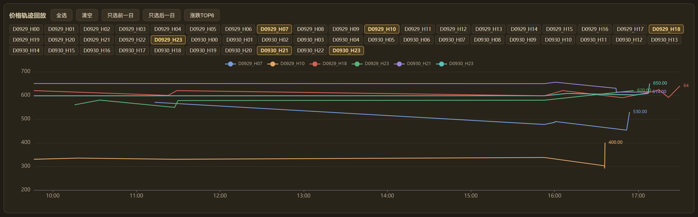

# 滚动撮合 · 窗口价格监控看板

电力现货"滚动撮合"的本地可视化盯盘工具：**48 个小时窗口的价格、涨跌、成交量、买卖盘口、价格轨迹一屏全看**，实时推送、盘后复盘。

核心特点：**对交易平台零额外请求**——只旁听页面自己收到的数据，不给平台服务器增加任何负载。



## 功能特性

- **48 窗口全景**：红涨绿跌灰持平，最近变动的窗口保持高亮，涨跌基准三档切换（较集中竞争价 / 较上一次 / 较首轮）
- **预期价格哨兵**：导入 48 窗口买入/卖出预期价（Excel 直接粘贴或模板文件），画预期曲线，达标窗口自动描边 + 顶部横幅点名
- **预期满足监控**：选定重点窗口（≤12 个），按分钟级间隔自动巡检买卖五档，对照你的预期价给出满足判定（可吃量 vs 竞争量，✅/⚠️/❌ 三态）
- **价格轨迹回放**：任意窗口撮合期间的价格演变折线，一键选涨跌 TOP6
- **盘口按需查询**：点击柱子查看该窗口买卖五档（与人工点选完全等价，带缓存与节流）
- **明暗双主题**：🌙/☀️ 一键切换，记忆偏好，首次跟随系统
- **复盘留痕**：原始响应逐条带时间戳落盘，明细表一键导出 CSV
- **稳健的标的识别**：跨交易日自动归档，多日标的（2/4/5 日跨度）完整支持，查看历史交易窗口不污染当前看板



## 工作原理

页面自己每隔几秒会向平台请求一次最新数据——数据本来就已经到达本机。本工具通过浏览器调试协议（CDP）**从浏览器缓冲区读取页面已收到的响应**，全程不向平台发任何额外请求；监控流量与人工开着页面完全相同。

```
平台页面自动刷新 → CDP 网络事件 → 浏览器缓冲区取响应 → 解析合并
→ 本地状态 + 原始留痕 → SSE 推送看板（+0.5s）
```

所有数据仅存本地；登录凭证只在浏览器内使用，不打印、不落盘、不外传。看板与巡检的请求数在状态栏实时可见、随时可核对。

## 快速开始

**环境**：Windows + Chrome/Edge + Node.js（v22+）

```bash
# 一键配置环境（自动检测并安装 Node.js LTS；也可手动到 nodejs.org 下载）
双击「一键配置环境.bat」

# 使用（两个双击）
双击「启动Chrome调试.bat」  # 或 Edge 版，登录你自己的交易平台账号，进入滚动撮合页
双击「启动监控.bat」         # 看板自动打开 http://127.0.0.1:8787
```

预期价格：在看板"预期价格模板"框直接从 Excel 粘贴（每行：时段 买入价 卖出价），或把包内 `expect-blank.xlsx` 改名为 `预期价格模板.xlsx` 填入自己的价格。

更多细节见包内《使用说明.md》与《分发说明-给接收方.md》。

## 技术栈

- **零第三方依赖**：Node.js 内置模块 + 原生 WebSocket 直连 CDP；连 Excel 模板读取都是内置 zlib 手写的 xlsx 解析（ZIP 结构 + XML），clone 即用、无 npm install
- 单文件看板前端（本地内置 ECharts，离线可用），SSE 实时推送 + 断线降级轮询
- 适配新平台：`node monitor.mjs --discover` 被动发现接口 → 在 `parser.mjs` 固化字段映射

## 声明

本项目仅供个人学习与自有账号的数据可视化使用；请使用自己的账号、遵守所在平台的规则；所有数据仅保存在本地。

## License

[MIT](LICENSE)
